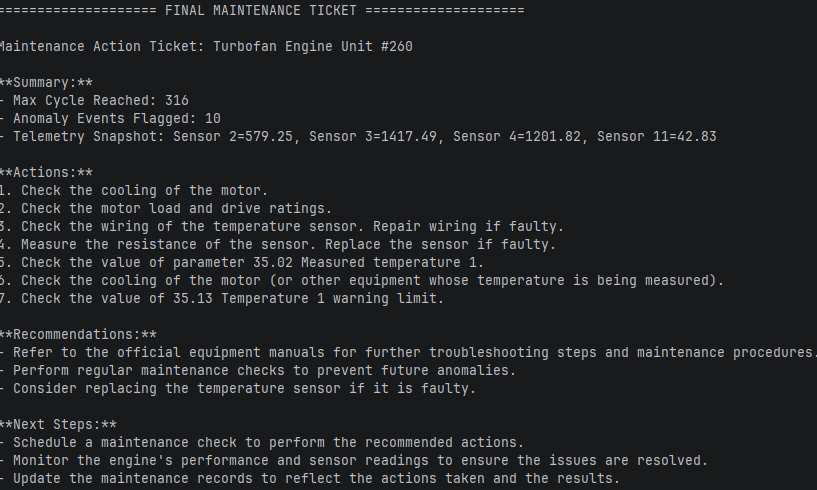

# Autonomous Industrial Maintenance Agent & RAG Pipeline

An end-to-end Agentic AI system that continuously monitors multivariate industrial time-series data, detects equipment degradation using Machine Learning, and autonomously queries technical equipment manuals via Retrieval-Augmented Generation (RAG) to generate structured Maintenance Action Tickets.




---

## System Architecture

```text
                               ┌─► Tool 1: ML Anomaly Detector (Isolation Forest on 160k+ NASA Rows)
[User / System Input] ──► [LangGraph ReAct Agent]
 (e.g. Unit #260)              └─► Tool 2: Semantic RAG System (ChromaDB + Technical PDF Manuals)
                                       │
                                       ▼
                       [Structured Maintenance Action Ticket]


